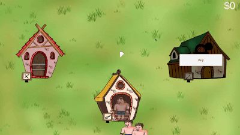
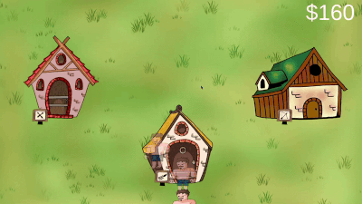

<h1 align="center"> Hero Path Tycoon </h1>

  
  

<h4 align="center">
:construction: Project under development :construction:
</h4>

Hero Path Tycoon is a personal mobile game project developed in Unity using C#. It’s an idle/tycoon-style game where the player builds and manages a superhero academy. The core gameplay revolves around expanding the academy by purchasing and upgrading buildings, training apprentices to increase efficiency, and reinvesting earnings to grow the facility further. As the sole developer, I designed and implemented the core systems, including the tycoon logic, resource flow, upgrade mechanics, UI interactions, and overall architecture. This project was created to strengthen my portfolio and demonstrate my ability to build scalable management gameplay systems from scratch. All assets and code included in this repository are open and available.

<h4 align="center">
:construction: Project under development :construction:
</h4>

## :hammer: Project Features

- `Feature - Buildings`: The buildings can be unlocked.
- `Feature - Hero Paths`: Different types of heroes and their specific paths.
- `Feature - Economy`: The economy of the game depends on the time that the user needs to spend to get enough money to upgrade the buildings.
- `Feature - Unit Tests`: Some of the code is supported by Unit Tests, using NUnit.

## :construction_worker: Next Steps

- `Unit Tests`: Add more Unit Tests for a good code average.
- `Building progression`: The concept is that the building can evolve, and both the currency and efficiency of the building should be enhanced.
- `Art`: Enhance the Art and the overall feel of the game.
